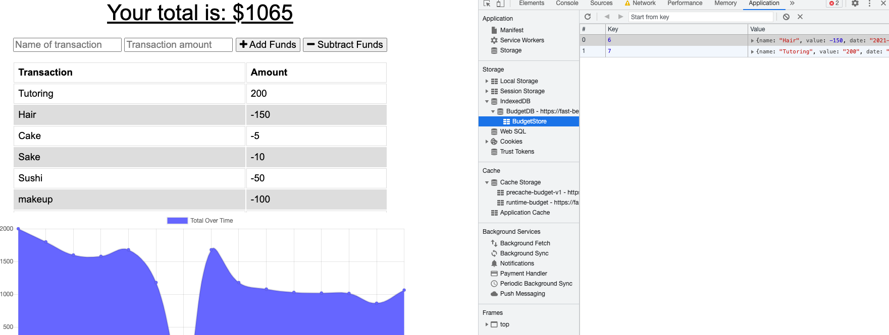

# budget-tracker

## Links
Link to deployed application [Heroku Link](https://fast-beyond-42631.herokuapp.com/)

## Summary
Adding offline functionality to the exisitng Budget tracker to transform it into a progressive web application.  

## Table of Contents
1. [Usage](#usage)
2. [SetUp](#setup)
3. [What I Learned](#what-i-learned)
4. [Resources](#resources)

## Usage
Converting the previously created budget tracker from week 17 NoSQL mini-project into a progressive web application (PWA). The user will be able to track, add, and subtract funds to/from their budget with or without internet connection. While offline the user can still enter deposits or expenses then once back online the transactions will be added to the tracker so it is updated. 

## Setup
This application is a PWA which contain three main components: a manifest, service worker, and cache. In order to cache dynamic data (a useres withdrawals or deposits) an indexedDB from the previous module was added.

The webpack.config.js file was made first to set up the web manifest and get the bundle.js files created to handle compression. The web app manifest provides a list of important information about the applicationin that is stored in a JSON text file. This helps the user have quicker access to the application if installed on their device. 

Next created was the service worker which is a javascript file that runs serparately from the main browser. The service worker intercepts network requests and also handles caching and can deliver push messages. Serivce workers also provide offline access to cached content. The cache holds information/ pages/ files what you may need to access while offline. 

IndexDB is also used to store or hold data/ transcations inside the users browser while the application is offline. The db.js file used in this application was copied from week 17 mini-project but some tweeks were added to it so that the indexDB and service worker could work together. While offline the user can still enter deopsits or expenses into the app those transactions are then stored in the IndexDB on the users browser. 

## What I Learned
This project came with multiple hurdles. The first being getting the cache to work. The solution was simply clearing out the stored data that was holing on to old code/data. Once that was cleared the applicaton worked. 

Another obstacle was getting the app to function while offline. I ran into the problem of the saveRecord function in index.js not working. The fix was to export the saveRecord function from the db.js file and then imoporting it back into the index.js file. 

The service worker also had a bug that needed to be fixed so the applicaton could work while offline. The addEventListner that listened for any "fetch" requests was a bit too broad and so I had to tell it to listen for the specific requests that included api/transactions. This made the application fallback to the cache if network requests failed while offline. From there it would move on to the next step. 

## Resources
* [Using IndexDB](https://developer.mozilla.org/en-US/docs/Web/API/IndexedDB_API/Using_IndexedDB)
* [Service Worker](https://developers.google.com/web/ilt/pwa/live-data-in-the-service-worker)
* [PWA Manifest](https://developer.mozilla.org/en-US/docs/Web/Manifest)
* [What is a PWA](https://developer.mozilla.org/en-US/docs/Web/Progressive_web_apps) 
* [Webpack Config](https://webpack.js.org/configuration/) 